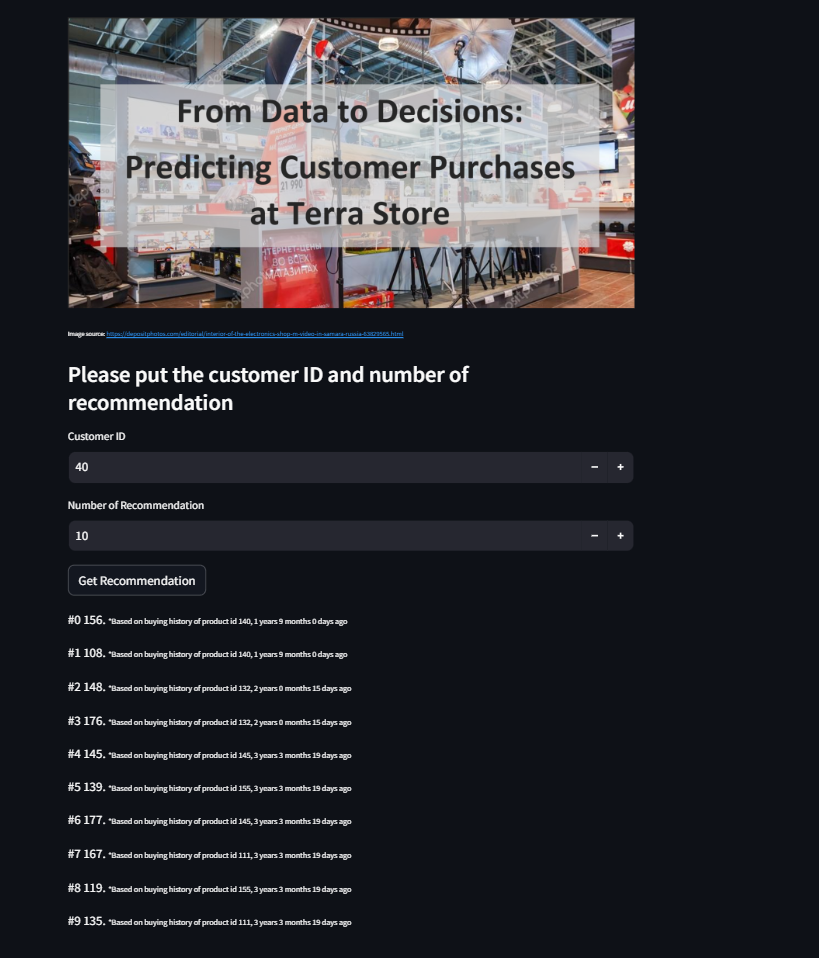

# Terra Store Recommendation System

The Terra Store Recommendation System is a Streamlit app designed to provide personalized product recommendations for customers based on their purchase history. This document provides the steps for setting up and running the application from the GitHub repository.

The online app can be accessed here: https://ai-skilvul-tech-test-rizqi-okta-ekoputris.streamlit.app/

# Run locally
## Prerequisites

- Git
- Python
- Pip

Ensure you have the above prerequisites installed and properly configured on your system before proceeding.

## Installation

### Step 1: Clone the Repository

Clone the Terra Store Recommendation System repository to your local machine by running:

```bash
git clone https://github.com/riokt/DS-Skilvul-Tech-Test.git
```

This command creates a local copy of the repository in a folder named `DS-Skilvul-Tech-Test`.

### Step 2: Navigate to the Project Directory

Change into the project directory:

```bash
cd DS-Skilvul-Tech-Test
```

### Step 3: Install Dependencies

Install the required Python libraries specified in the `requirements.txt` file:

```bash
pip install -r requirements.txt
```

### Step 4: Run the Streamlit App

Launch the Streamlit app:

```bash
streamlit run main.py
```

Upon running this command, your default web browser should open to the app. If it doesn't, check the terminal for the local URL to access it manually.

## Using the App

1. **Enter Customer Information**: Input a Customer ID in the provided field. This should be a numerical identifier corresponding to a customer in your system.
2. **Specify Number of Recommendations**: Enter how many product recommendations you want to generate.
3. **Generate Recommendations**: Click the "Get Recommendation" button to produce a list of product suggestions based on the customer's buying history.

App preview:


## Troubleshooting

If you encounter issues:

- Ensure all prerequisites are installed and up to date.
- Check the terminal for error messages.
- Confirm you're in the correct directory and that all files are in place.

## Updates

For updates and changes, navigate to the project directory and run:

```bash
git pull
```

This command fetches the latest updates from the repository.

## Conclusion

By following these instructions, you should be able to set up and use the Terra Store Recommendation System. For more details on Streamlit and how to enhance the app, refer to the [Streamlit documentation](https://docs.streamlit.io/).